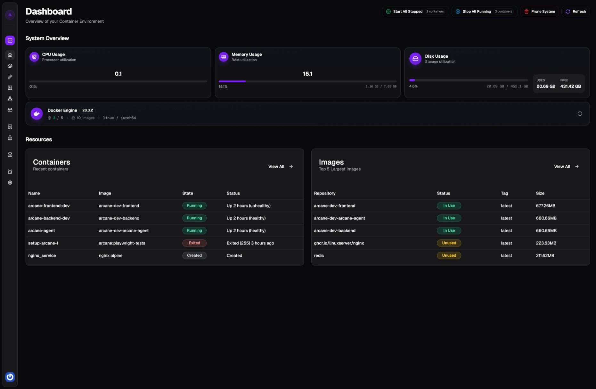

> [!IMPORTANT]
> All Arcane repos are in the process of moving to the [@getarcaneapp](https://github.com/getarcaneapp) org on GitHub. This means the images used for Arcane for all future releases (past 1.7.2) will use a new image repo and tag.
> Currently only the templates and website repos have moved. The main repository will be moved in the coming days.

  
  
Modern Docker Management, Designed for Everyone.

Arcane is designed to be an easy and modern Docker management platform, built with everybody in mind. The goal of Arcane is to be built for and by the community to make sure nobody feels left out or behind with their specific features or processes.

---

## Documentation

For setup instructions, configuration details, and development guides, visit the **[official documentation site](https://getarcane.app)**.

---

## Translating

Help translate Arcane on Crowdin: https://crowdin.com/project/arcane-docker-management

---

Thank you for checking out Arcane! Your feedback and contributions are always welcome.
