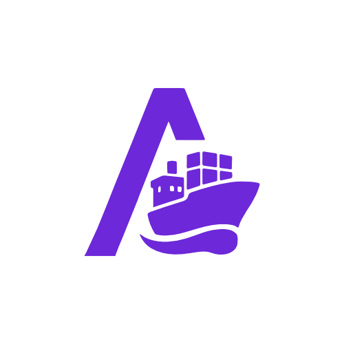

> [!IMPORTANT]  
> **⚠️** All Development on the `main` branch is halted. In preparation for `1.0`. The `1.0.0` branch should be used for any pull requests or contributions until 1.0 has been released.

<h1 align="center">Arcane - Docker Management UI</h1>

  

> [!IMPORTANT]  
> **⚠️** Arcane is currently pre-release software. Features may change, and bugs are expected. Please report any issues with the `Bug` template on Github.

Arcane is a modern, web-based interface for managing your Docker environment, built with SvelteKit. It offers a clean, intuitive overview and powerful management tools for your containers, images, volumes, and networks—all in one place.

---

## Why Arcane?

I created Arcane because I couldn’t find a Docker UI that was both simple and feature-rich enough for my needs. Every feature in Arcane is something I personally found missing or cumbersome in other tools. As the project grew, it became clear that others might benefit from it too.  
If you have suggestions, feedback, or feature requests, please open an issue or submit a pull request!

---

---

## Documentation

For setup instructions, configuration details, and development guides, visit the **[official documentation site](https://arcane.ofkm.dev)**.

---

## Important Notes

- **Security:** Mounting the Docker socket (`/var/run/docker.sock`) into any container grants it root-level access to your Docker host. Understand the security implications before running Arcane or any container with socket access.
- **Pre-release:** Arcane is under active development. Expect breaking changes and bugs.
- **Data:** Stack definitions and application settings are stored in the mapped data volume (`/app/data` inside the container). Back up this directory if needed.

---

Thank you for checking out Arcane! Your feedback and contributions are always welcome.
